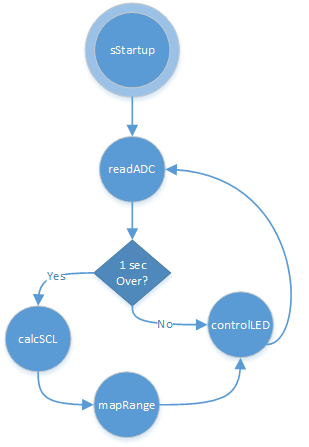

# EDA Sensor Board 
This repository is an initial prototype of a low-cost [Electrodermal Activity](https://en.wikipedia.org/wiki/Electrodermal_activity) Sensor that I was working on in early 2014. This sensor measures electrodermal activity at the index and middle fingers and this current prototype is in a ring form-factor. 

### Circuit Description
The circuit is a resistor divider connected to a Texas Instruments INA337 instrument amplifier. The output is passed through an anti-aliasing filter before being read by the 10-bit ADC in an atTiny85 micro. 

### Firmware Description
The firmware is modelled as a state-machine which reads the ADC values, maps the average of 1s of data bytes into some coloring ranges and then controls an RGB-LED in real-time. The implemented state-machine is:

An working prototype as can be seen in the video below:

 
